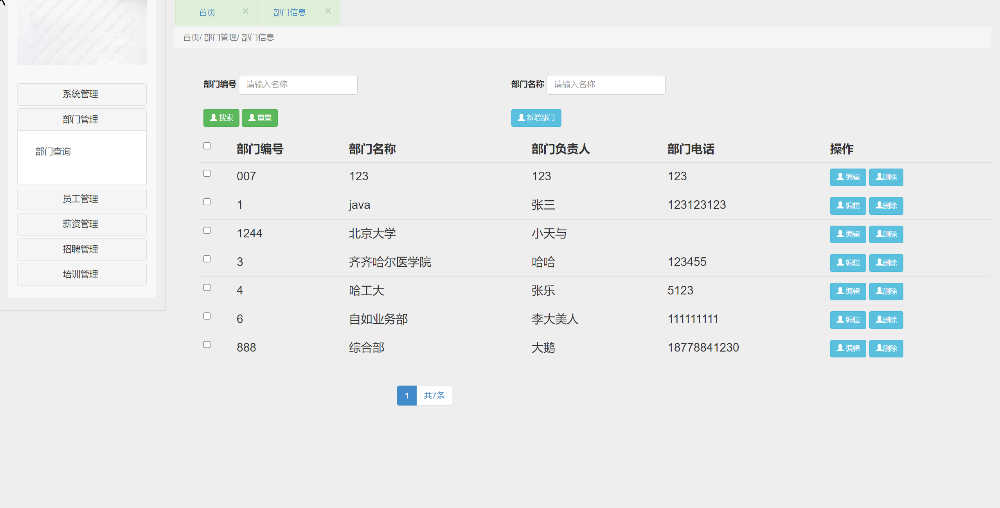
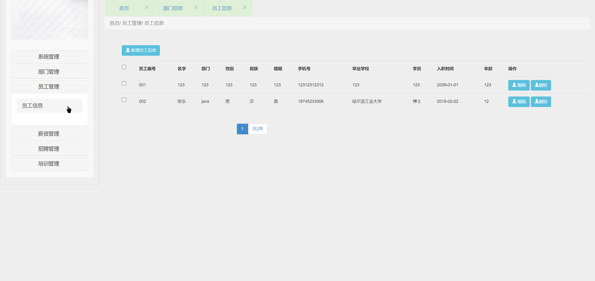
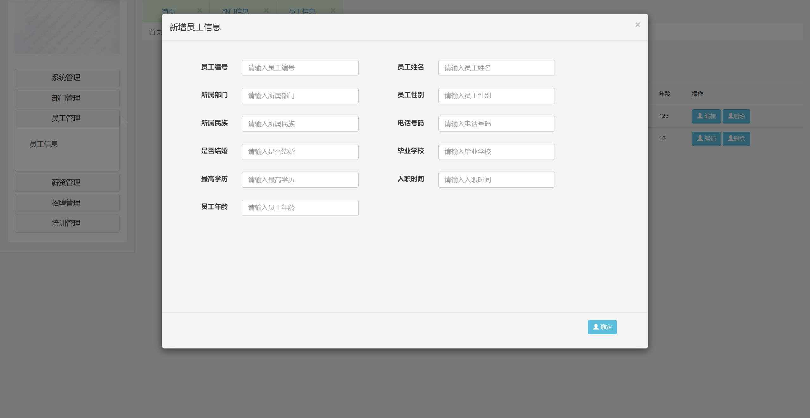
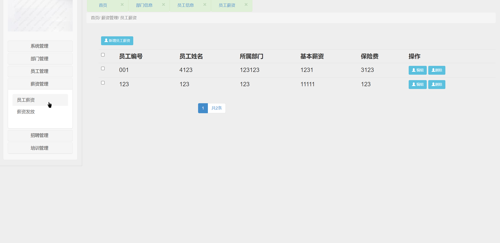
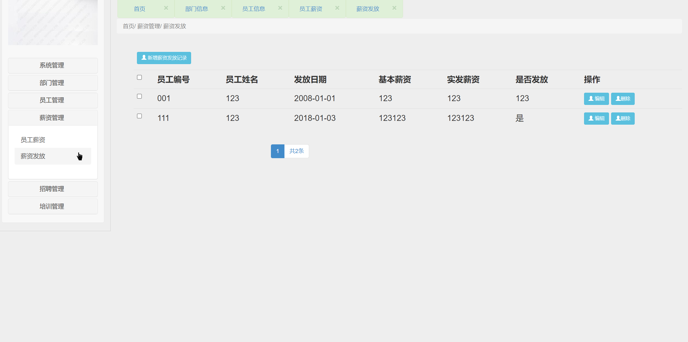
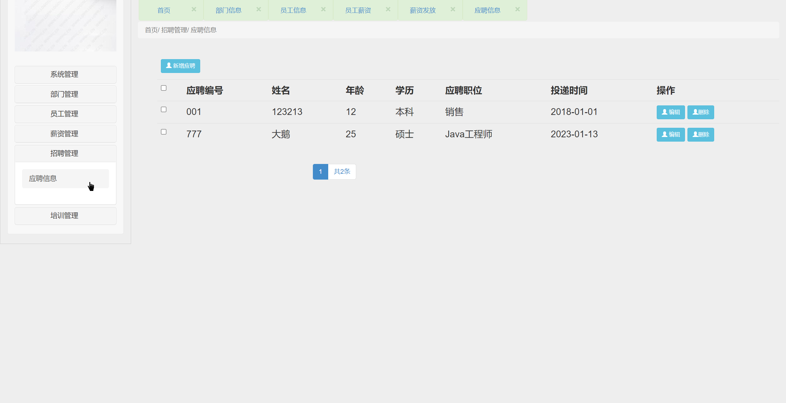
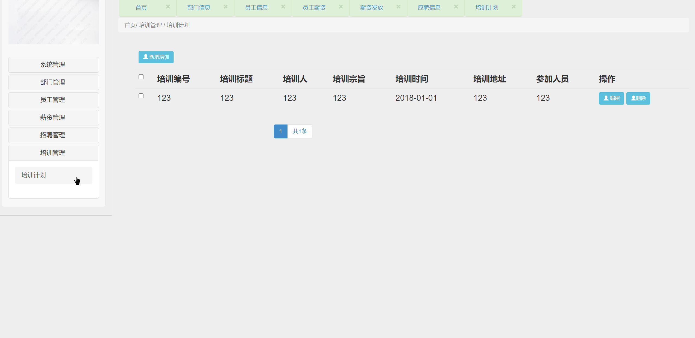

## 基于SSM的人力资源管理系统

- <b>完整代码获取地址：从戎源码网 ([https://armycodes.com/](https://armycodes.com/))</b>
- <b>技术探讨、资料分享，请加QQ群：692619798</b> 
- <b>作者微信：19941326836  QQ：952045282</b> 
- <b>承接计算机毕业设计、Java毕业设计、Python毕业设计、深度学习、机器学习</b>
- <b>选题+开题报告+任务书+程序定制+安装调试+论文+答辩ppt 一条龙服务</b>
- <b>所有选题地址 ([https://github.com/YuLin-Coder/AllProjectCatalog](https://github.com/YuLin-Coder/AllProjectCatalog)) </b>

## 项目介绍
基于SSM的人力资源管理系统，有员工和管理员两个角色，主要功能如下

系统管理：员工部门调动、权限设置 
部门管理：部门列表、部门添加、部门编辑、删除 
员工管理：员工的列表、员工的添加、员工信息修改和删除
薪资管理：员工薪资管理、员工薪资发放 
招聘管理：招聘信息管理 
培训管理：培训计划管理 
权限分为管理员和普通员工：
普通员工仅可以看自己的工资,自己的信息。仅可以编辑自己的信息,可以看到部门信息,员工账号不可更改。
管理员可以创建用户，删除用户，编辑用户。可以看到所有人的薪资，编写招聘信息，培训信息等。

## 项目技术
- 编程语言：Java
- 数据库：MySQL
- 前端技术：JSP、JavaScript、Jquery、BootStrap
- 后端技术：Spring、SpringMVC、MyBatis、Spring Security

## 运行环境
- JDK版本：JDK1.8及以上
- 开发工具：IDEA、Ecplise、Myecplise都可以
- 数据库: MySQL5.7及以上

## 运行截图

